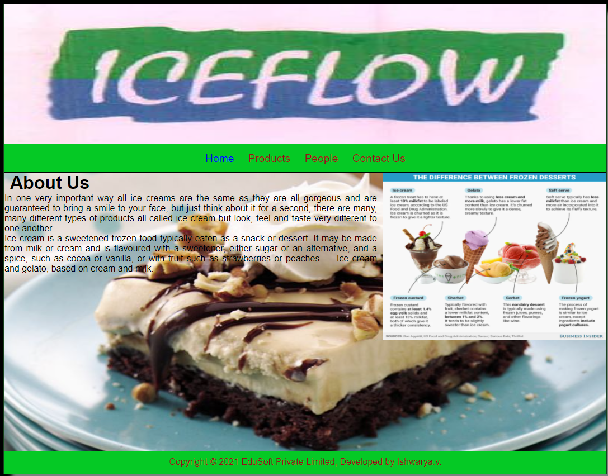
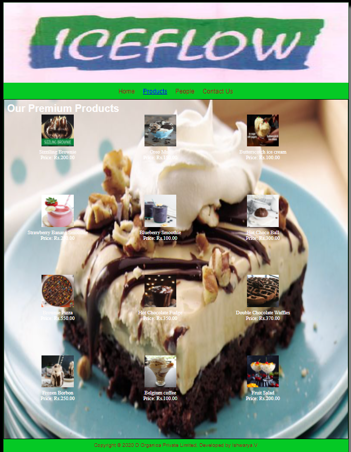
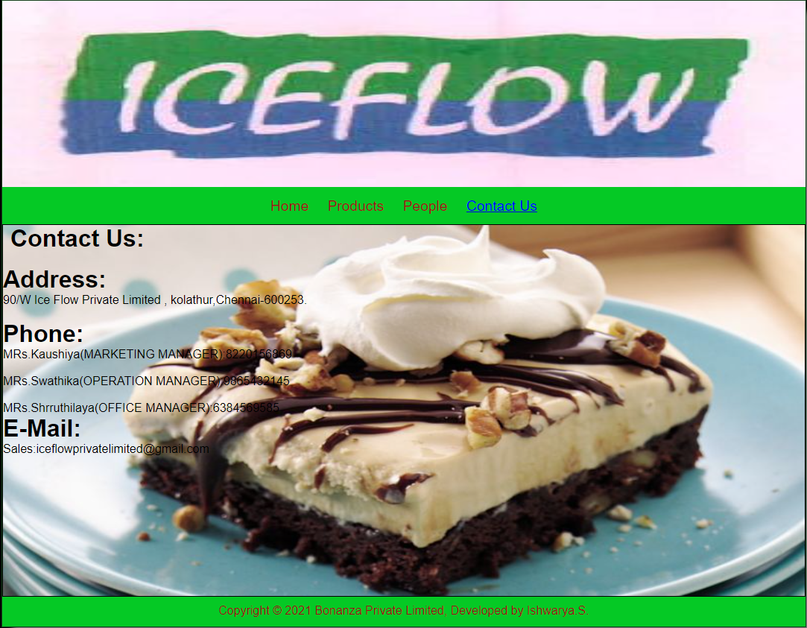

# Web Design for a Software Product Company

## AIM:

To design a static website for a software product company company.

## DESIGN STEPS:

### Step 1:

Requirement collection.

### Step 2:

Creating the layout using HTML and CSS.

### Step 3:

Updating the sample content.

### Step 4:

Choose the appropriate style and color scheme.

### Step 5:

Validate the layout in various browsers.

### Step 6:

Validate the HTML code.

### Step 6:

Publish the website in the given URL.

## PROGRAM :

### Home Page:
~~~
<!DOCTYPE html>
<html lang="en">
  <head>
    <title>Ice Flow</title>
    <link rel="stylesheet" href="./css/layout.css" />
    <link rel="icon" href="./img/icon.png" type="image/x-icon" />
  </head>

  <body>
    

      
 

      

        
<a href="/static/home.html">Home</a>

        
<a href="/static/products.html">Products</a>

        
<a>People</a>

        
<a>Contact Us</a>

      

      

        

          <h1>About Us</h1>
          
          

            In one very important way all ice creams are the same as they are all gorgeous and are guaranteed to bring a smile to your face, but just think about it for a second, there are many, many different types of products all called ice cream but look, feel and taste very different to one another.
             
            Ice cream is a sweetened frozen food typically eaten as a snack or dessert. It may be made from milk or cream and is flavoured with a sweetener, either sugar or an alternative, and a spice, such as cocoa or vanilla, or with fruit such as strawberries or peaches. ... Ice cream and gelato, based on cream and milk.
            
          

        

      

      

        Copyright &#169; 2021 EduSoft Private Limited, Developed by Ishwarya.v.
      

    

  </body>
</html>
~~~

### Product Page:
~~~
<!DOCTYPE html>
<html lang="en">
  <head>
    <title>Ice Flow</title>
    <link rel="stylesheet" href="./css/layout.css" />
    <link rel="icon" href="./img/icon.png" type="image/x-icon" />
  </head>

  <body>
    

      

      

        
<a href="/static/home.html">Home</a>

        

          <a href="/static/products.html">Products</a>
        

        
<a>People</a>

        
<a>Contact Us</a>

      

      

        
    
          <h1>Our Premium Products</h1>
          

              
 
                  

                  
                  

                  
Sizziling Brownie

                  
Price: Rs.200.00 

              

              
 
                  

                  
                  

                  
Oreo Mud

                  
Price: Rs.150.00 

              

              
 
                  

                  
                  

                  
Butterscotch ice cream

                  
Price: Rs.100.00 

              

              
 
                  

                  
                  

                  
Strawberry Banana Smoothie

                  
Price: Rs.250.00 

              

              
 
                    

                    
                    

                    
Blueberry Smoothie

                    
Price: Rs.100.00 

                

                
 
                  

                    
                    

                    
Hot Choco Ball

                    
Price: Rs.300.00 

                

                
 
                  

                  
                  

                  
Brownie Pizza

                  
Price: Rs.550.00 

               

               
 
                  

                  
                  

                  
Hot Chocolate Fudge 

                  
Price: Rs.350.00 

               

               
 
                  

                  
                  

                  
Double Chocolate Waffles

                  
Price: Rs.370.00 

               

               
 
                  

                  
                  

                  
Frozen Borbon

                  
Price: Rs.250.00 

               

               
 
                  

                  
                  

                  
Belgium coffee

                  
Price: Rs.100.00 

               

               
 
                  

                  
                  

                  
Fruit Salad

                  
Price: Rs.200.00 

                

               
          

          
        
      

      

        Copyright &#169; 2020 D Organica Private Limited, Developed by Ishwarya.V
      

    

  </body>
</html>
~~~

### People Page:
~~~
<!DOCTYPE html>
<html lang="en">
  <head>
    <title>Ice Flowd</title>
    <link rel="stylesheet" href="./css/layout.css" />
    <link rel="icon" href="./img/ail.png" type="image/x-icon" />
    </head>
    <body>
    

      

      

        
<a href="/static/home.html">Home</a>

        
<a href="/static/products.html">Products</a>

        
<a href="/static/people.html">People</a>

        
<a href="/static/contactus.html">Contact Us</a>

        

      

        

          <h1>Our company employees:</h1>  
          

            
 
                

                
                

                
Shriram

                
Founder

            

            
 
                

                
                

                
AAKASH

                
Office manager

            

            
 
              

              
              

              
JEEVA

              
Assistant HR

            

            
 
              

              
              

              
RAJESH

              
Marketing Manager

          

          
 
            

            
            

            
HARISH

            
Professional Staff

        
  
 
          

          
          

          
SIDDHU

          
Operation Manager

      

          

        

        
        
    

    

      Copyright &#169; 2021 Bonanza Private Limited, Developed by Ishwarya.V
    

  

</body>
</html>
~~~

### Contact Us Page:
~~~
<!DOCTYPE html>
<html lang="en">
  <head>
    <title>Ice Flow</title>
    <link rel="stylesheet" href="./css/layout.css" />
    <link rel="icon" href="./img/ail.png" type="image/x-icon" />
  </head>

  <body>
    

      

      

        
<a href="/static/home.html">Home</a>

        
<a href="/static/products.html">Products</a>

        
<a href="/static/people.html">People</a>

        
<a href="/static/contactus.html">Contact Us</a>

      

      

        

          <h1>Contact Us:</h1>  
          <h1>Address:</h1>
          

            90/W Ice Flow Private Limited , kolathur,Chennai-600253.
          
 
          <h1>Phone:</h1> 
          

              MRs.Kaushiya(MARKETING MANAGER):8220156869  
              MRs.Swathika(OPERATION MANAGER):9865432145  
              MRs.Shrruthilaya(OFFICE MANAGER):6384569585
          

          <h1>E-Mail:</h1> 
          

              Sales:iceflowprivatelimited@gmail.com
          

        

      

      

        Copyright &#169; 2021  Bonanza Private Limited, Developed by Ishwarya.S.
      

    

  </body>
</html>
~~~

### Layout CSS Page:
~~~
* {
  box-sizing: border-box;
  font-family: Arial, Helvetica, sans-serif;
}
body {
  background-color: black;
  color: #17421d;
}
.container {
  width: 1080px;
  margin-left: auto;
  margin-right: auto;
  border-width: 1px 1px 1px 1px;
  border-style: solid;
  box-shadow: 15px 15px 8px gray;
}

.banner {
  display: block;
  width: 100%;
  height: 250px;
  text-align: center;
  font-size: 60px;
  background-image: url("https://s3.amazonaws.com/zaubatrademarks/6af8b102-3ffe-4006-a6ad-82157c21904c.png");
  background-size: 100% 100%;
  margin: 0px 0px 0px 0px;
  padding-top: 150px;
  color: #018317;
}

.menu {
  display: block;
  width: 100%;
  height: 50px;
  font-size: larger;
  background-color: rgb(5, 201, 37);
  text-align: center;
  padding-top: 15px;
  margin: 0px 0px 0px 0px;
  border-width: 1px;
}

.menuitem {
  display: inline-block;
  margin-left: 10px;
  margin-right: 10px;
}
.menuitemselected {
  display: inline-block;
  margin-left: 10px;
  margin-right: 10px;
  color: #16d1ae;
}

.menuitem a {
  text-decoration: none;
  color: #9c1018;
}

.content {
  display: block;
  width: 100%;
  background-image: url("https://images-gmi-pmc.edge-generalmills.com/34c0ac81-656b-45f1-b0b9-6eff351f2dc9.jpg");
  min-height: 500px;
  background-size: 100% 100%;
  margin: 0px 0px 0px 0px;
  border-width: 1px;
  border-color: black;
  border-style: solid;
}
.homecontent {
  min-height: 500px;
  margin: 10px 10px 10px 10px;
  color: black;
  display: inline;
}
.homecontent h1 {
  color: black;
  display: inline;
  text-align: left;
}
.homecontent img {
  float: right;
  width: 400px;
  height: 300px;
  margin-left: 10px;
}

.contenttext {
  text-align: justify;
  color: black;
}

.productcontent {
  min-height: 500px;
  margin: 10px 10px 10px 10px;
}

.productcontent h1 {
  display: inline;
  color: rgb(253, 251, 251);
  text-align: left;
}

.productitems {
  display: block;
}

.productitem {
  display: inline-block;
  width: 30%;
  height: 250px;
  text-align: center;
}

.productitem img {
  width: 100px;
  height: 100px;
  display: inline-block;
}
.productitem .itemimage {
  display: inline-block;
  margin-left: auto;
  margin-right: auto;
  width: 100px;
  margin-bottom: 5px;
}

.productitem .itemname {
  display: block;
  color: rgb(253, 249, 249);
  font-family: block;
}
.productitem .itemprice {
  display: block;
  color: rgb(255, 255, 255);
  font-family: block;
}

.footer {
  display: block;
  width: 100%;
  height: 40px;
  background-color: rgb(5, 201, 37);
  text-align: center;
  padding-top: 10px;
  margin: 0px 0px 0px 0px;
  color: #9c1018;
}

.productitem1 .itemimage1 {
  display: inline-block;
  margin-left: auto;
  margin-right: auto;
  width: 100px;
  height: 40px;
  margin-bottom: 5px;
}

.productitem1 .itemprice1 {
  display: block;
  color: rgb(255, 255, 255);
  font-family: block;
}
~~~

## OUTPUT:

### Home Page:

### Product Page:

### People Page:
 

### Contact Us:

## Result:

Thus a website is designed for the software product company and the HTML,CSS code are validated.
